# Personal Finance App

> A personal finance dashboard for tracking transactions, managing budgets, and growing savings.

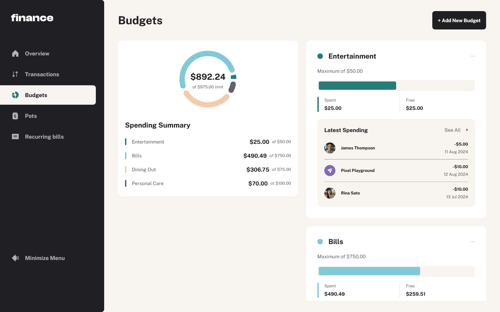

**Live Demo:** [personal-finance-app-rrn.vercel.app](https://personal-finance-app-rrn.vercel.app)

---

## Overview

Personal Finance App is a responsive financial management tool built as a Frontend Mentor challenge. Users get a full dashboard overview of their finances, can drill into paginated transactions, set and manage budgets, track savings in pots, and monitor recurring bills — all with keyboard accessibility and responsive layouts across all screen sizes.

---

## Features

- Dashboard overview of all financial data at a glance
- Paginated transaction list (10 per page) with search, sort, and filter
- Full CRUD for budgets — with the latest 3 transactions per budget category displayed
- Full CRUD for savings pots — deposit and withdraw money, track progress toward goals
- Recurring bills view with monthly status indicators, search, and sort
- Pie chart visualization of budget breakdown
- Form validation across all inputs
- Fully keyboard-navigable UI
- Responsive layout for mobile, tablet, and desktop

---

## Tech Stack

| Category | Technology |
|---|---|
| Framework | React + Vite |
| Language | TypeScript |
| Styling | Tailwind CSS |
| Routing | React Router |
| Forms | React Hook Form + Zod |
| UI Components | Radix UI |
| State Management | Zustand |
| Charts | Recharts |

---

## Getting Started

### Prerequisites

- Node.js `v18+`

### Installation

```bash
git clone https://github.com/nofuenterr/personal-finance-app.git
cd personal-finance-app
npm install
```

### Running the App

```bash
npm run preview
```

### Build

```bash
npm run build
```

---

## Screenshots

### Overview
| Desktop | Tablet | Mobile | 
|---|---|---|
| 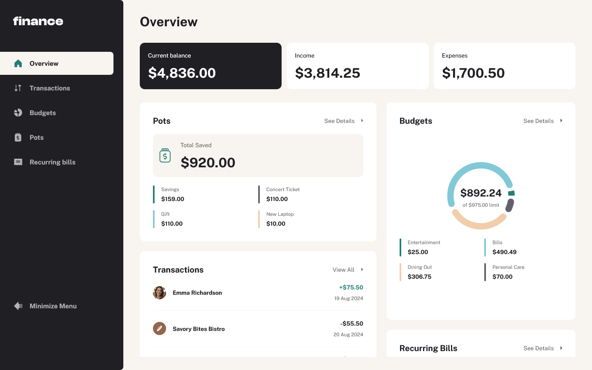 | 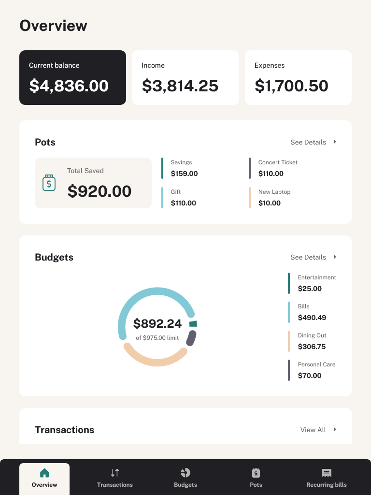 | 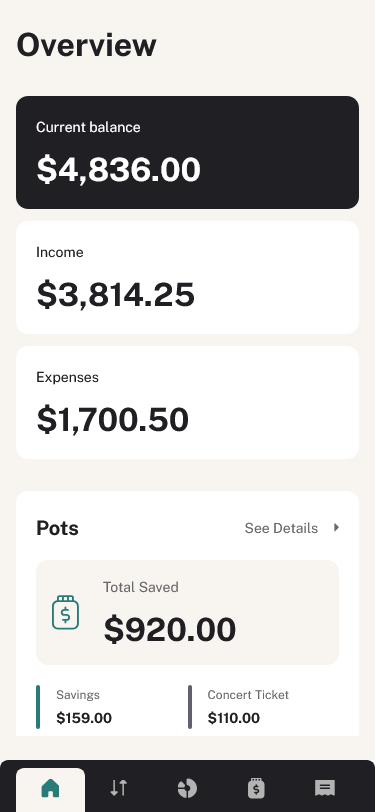 |

### Transactions
| Desktop | Tablet | Mobile | 
|---|---|---|
| 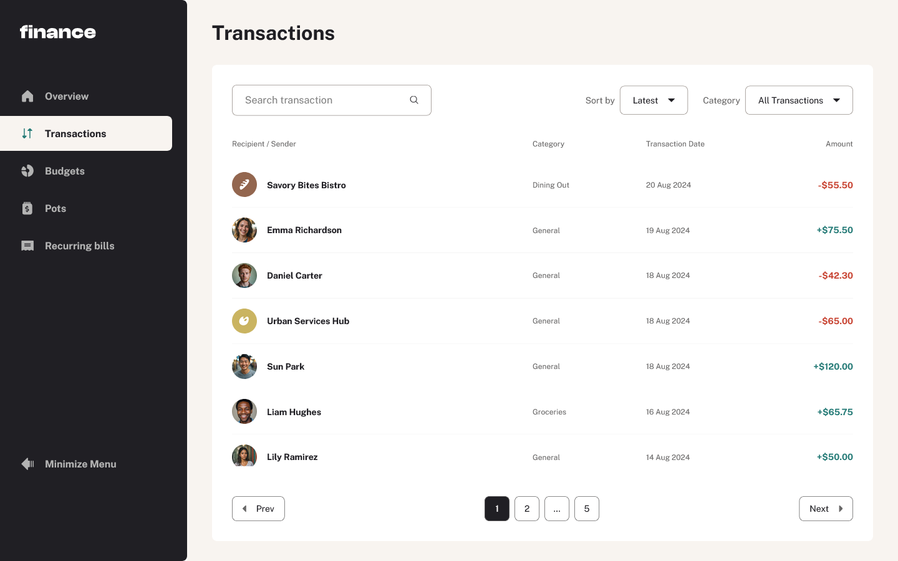 | 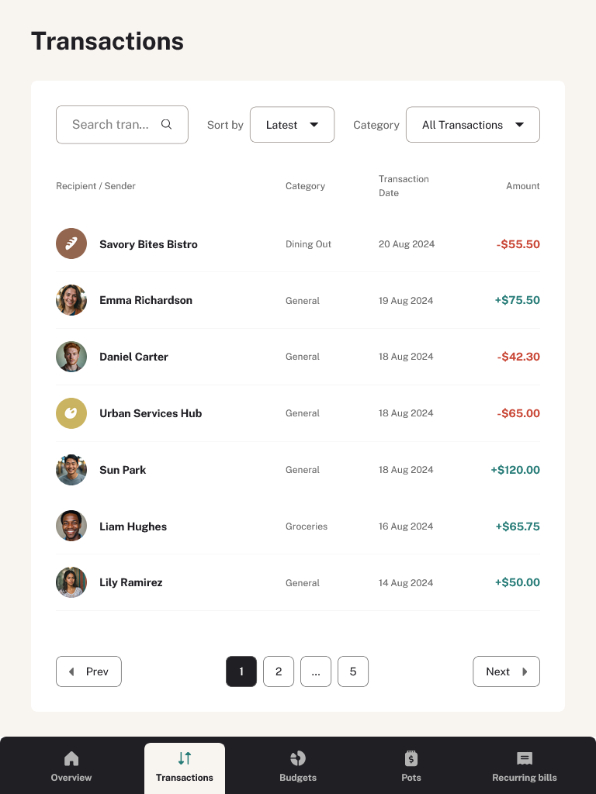 | 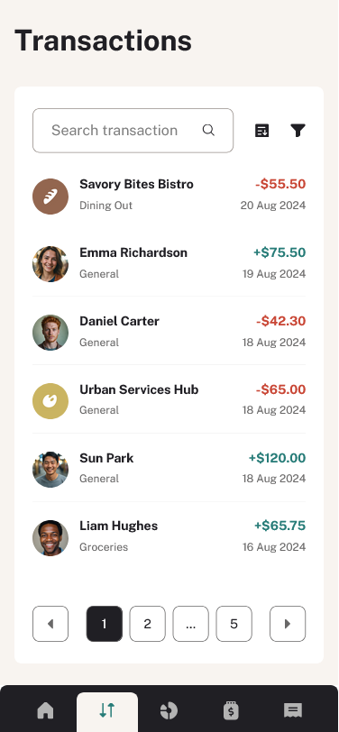 |

### Budgets
| Desktop | Tablet | Mobile | 
|---|---|---|
|  | 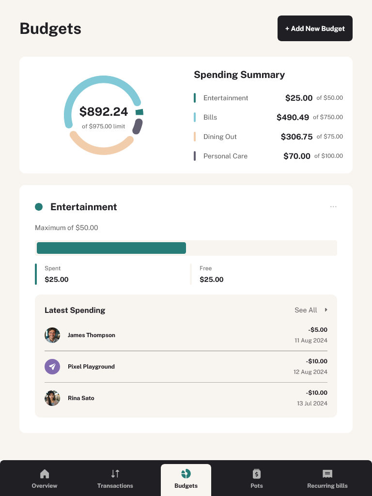 | 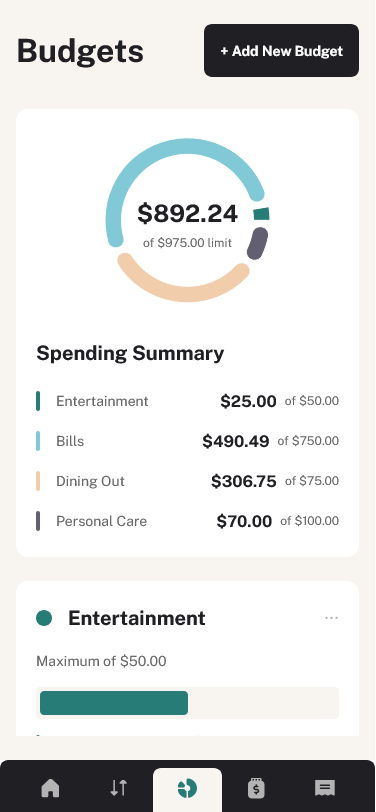 |

### Pots
| Desktop | Tablet | Mobile | 
|---|---|---|
| 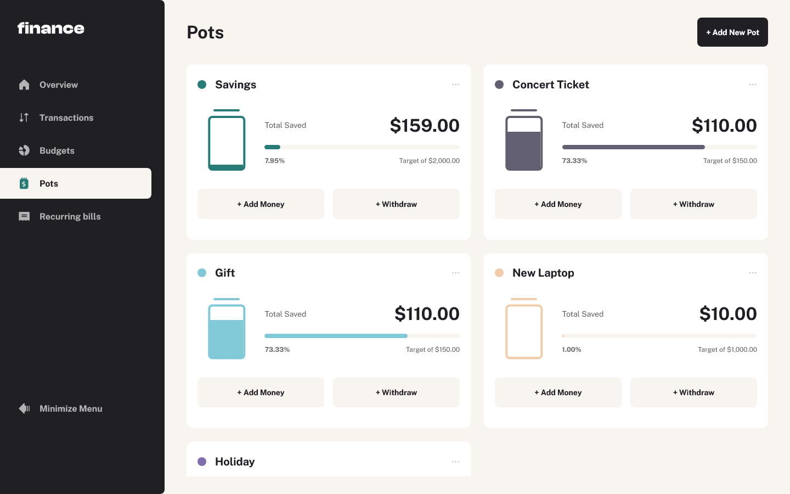 | 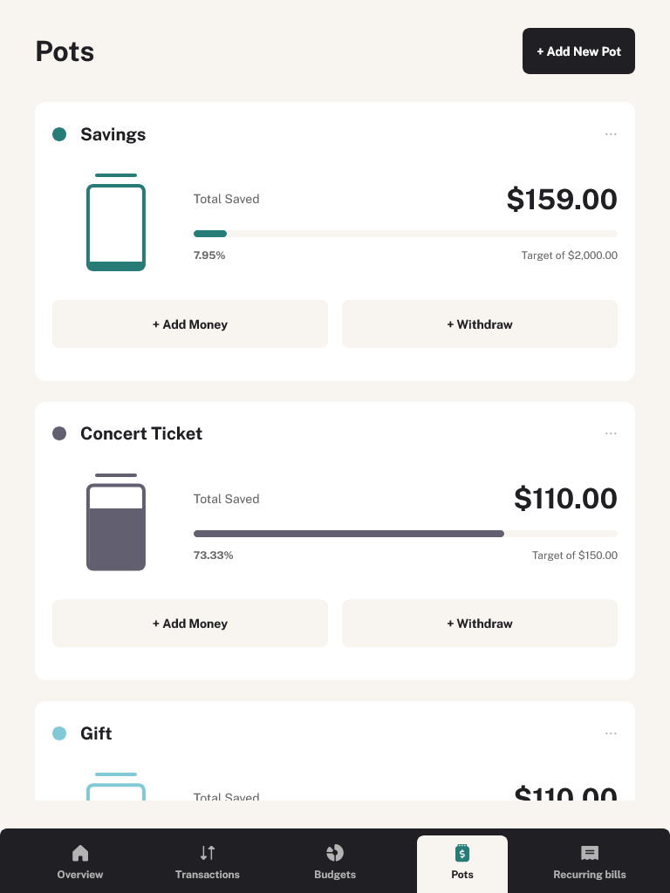 | 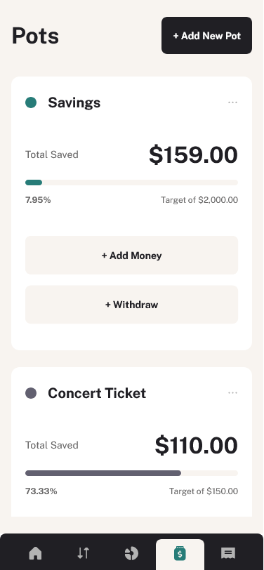 |

### Recurring Bills
| Desktop | Tablet | Mobile | 
|---|---|---|
| 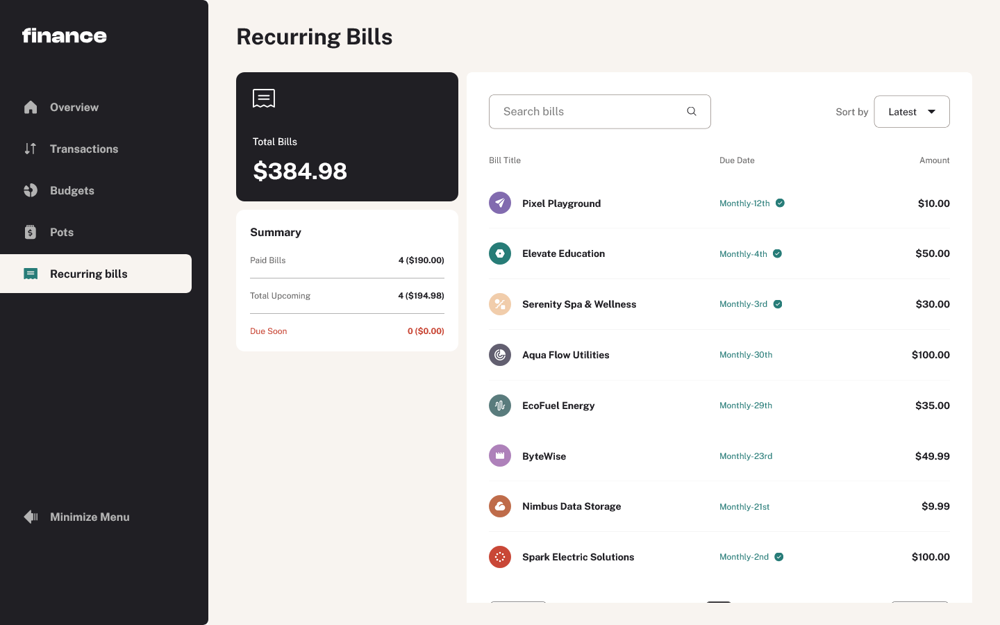 | 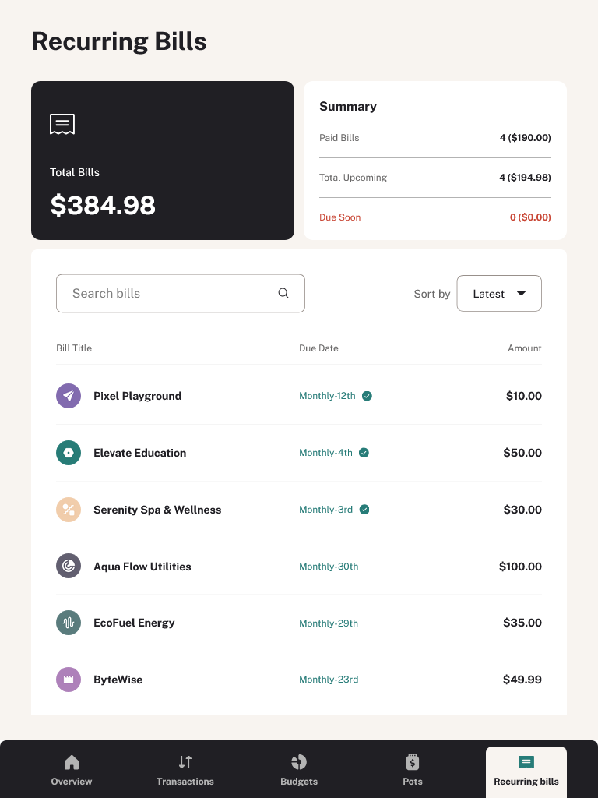 | 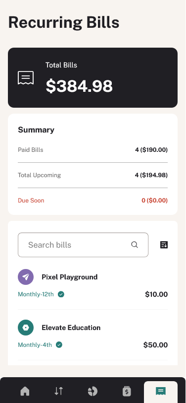 |

---

## To-do

- [ ] Animations and transitions (e.g. sidebar open/close)
- [ ] Form for adding new transactions and recurring bills
- [ ] Fix scrollbar positioning (overlapping content)
- [ ] UI polish and code refactor for readability

---

## Credits

This project is a solution to a [Frontend Mentor](https://www.frontendmentor.io) challenge. I do not own the rights to any assets used.

---

*Developed by **RR Nofuente***